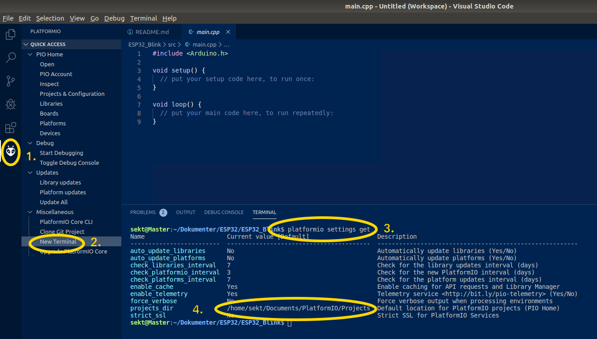
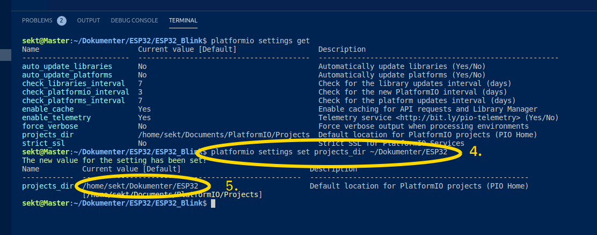
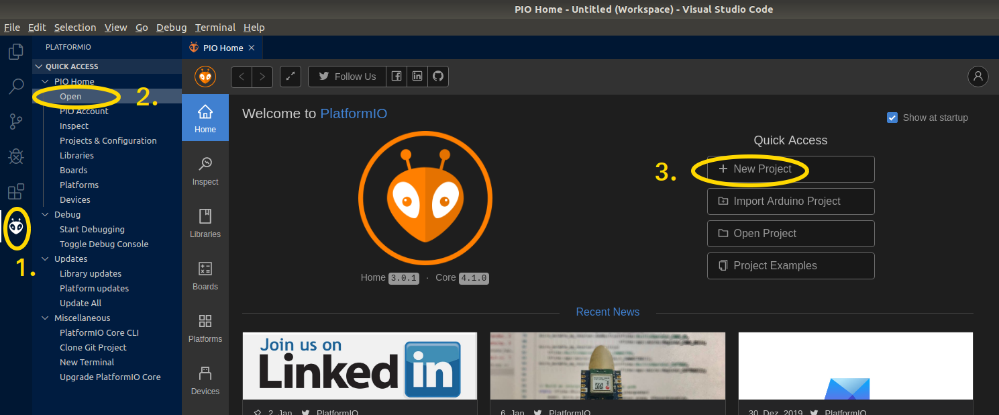
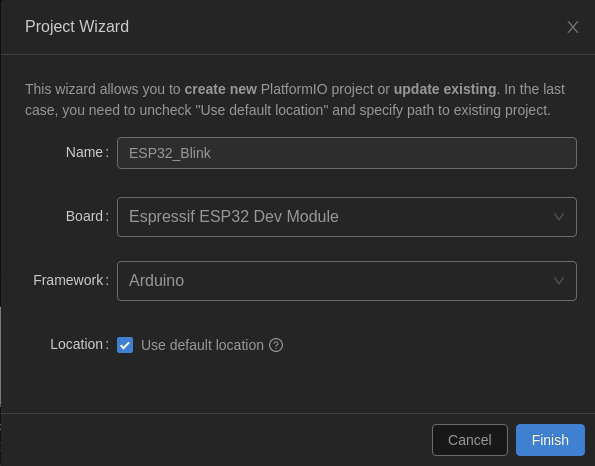
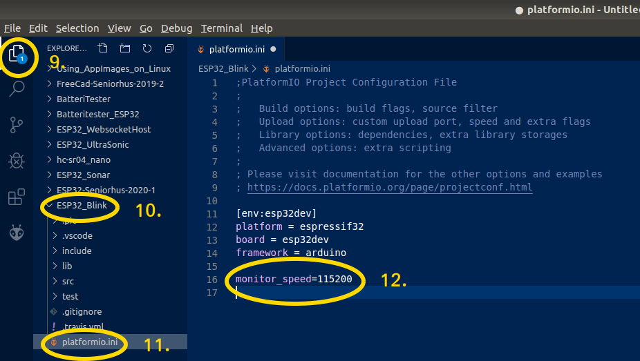

# ESP32-Seniorhus-2020-1 Robot & Microprosessor Kursus
Min ide er at oprette et kursus hvor vi bruger en lille microprossor ESP32 som har både Bluetooth, Wifi og Flash disk indbygget, med den kan vi styre vores udstyr fra en Smartphone eller iPad.  
Jeg vil bruge Platformio, Microsoft’s  Visual Studio Code, sammen med Arduino IDE, når vi kommer i gang skal vi samarbejde med 3D holdet om at lave dele til en robot, bil eller andet som vi kan styre.  
Jeg har lavet ESP32 udviklings kit til dette kursus som eleverne får udleveret ved kursus start, softwaren vi skal bruge er gratis. 
Eleverne skal selv medbringe en Pc til kursuset, undervisningen vil bruge et mødelokale til teori og 1.sal på metal værkstedet til praktiske opgaver.

Kursus starter den 8/1 2020 kl.: 12:30, mødested metalværkstedet  
* Niels Jørgen Jensen vil holde de første møder fra 8/1 til 26/2, hvor i vil begynde at definere den robot I skal bruge.
* Svenn-Erik K. Thomsen vil begynde undervisning i programering den 8/1 2020 kl.: 12:30

## Tilmelding kan ske på ved af udfyllde spørgsmålene i disse link
Robot & Microprosessor Kursus 2020 :
https://docs.google.com/forms/d/e/1FAIpQLSfGfbgsCQq_kk3sPVGyZUx6m9FqPH_HSMDtQ0DwIxAxN89SXg/viewform

## PCB Layout :


## ESP 32 Pin Layout :
  
[ESP32S-HiLetgo Dev Boad with Pinout Template](https://forum.fritzing.org/t/esp32s-hiletgo-dev-boad-with-pinout-template/5357)  

### Espressif ESP32 :  
[ESP32 Datasheet PDF](https://www.espressif.com/sites/default/files/documentation/esp32_datasheet_en.pdf)  
[ESP32-DevKitC V4 Getting Started Guide](https://docs.espressif.com/projects/esp-idf/en/latest/hw-reference/get-started-devkitc.html)
### ESP32-DevKitC :
[ESP32-DevKitC PinOut](https://www.cloudynights.com/uploads/gallery/album_9650/gallery_16487_9650_1843894.png)  
[ESP32-DevKitC Diagram](http://esp32.net/images/Ai-Thinker/NodeMCU-32S/Ai-Thinker_NodeMCU-32S_DiagramSchematic.png)  
[ESP32_Function_Block_Diagram](http://esp32.net/images/_resources/ESP32_Function_Block_Diagram.svg)  

### ESP32-CAM:
[ESP32-CAM PinOut](https://circuitdigest.com/sites/default/files/inlineimages/ESP32-CAM-Module-PinOut.jpg)  
[ESP32-CAM Diagram](https://preview.redd.it/yv050peu22p21.png?width=1222&format=png&auto=webp&s=6bda5db94ed155bb428e1bb02e1a362c447fa9eb)  
[ESP32-CAM Flashing](https://www.14core.com/wp-content/uploads/2019/07/esp32-cam-flashing-guide-wiring-schematics-diagram-768x255.jpg)
[ESP32-S CAM in Face Detection and Recognition with ESP-IDF / ESP-WHO Library](https://www.14core.com/esp32-s-cam-in-face-detection-and-recognition-with-esp-who-library/)

## Matrialer til CPU kort :
| Navn | Link |
| ---- |--- |
| ESP32 | https://www.aliexpress.com/item/32807887667.html?spm=a2g0s.9042311.0.0.21714c4dOmX9y0 |
| Ole Display | https://www.aliexpress.com/item/32780054633.html?spm=a2g0s.9042311.0.0.21714c4dOmX9y0 |
| LED UltraBright | https://www.aliexpress.com/item/32262805477.html?spm=a2g0s.9042311.0.0.21714c4dOmX9y0 |
| 15mm rotary encoder | https://www.aliexpress.com/item/33050894285.html?spm=a2g0s.9042311.0.0.21714c4dOmX9y0 |
| PCB Stripboard | https://www.aliexpress.com/item/32367760106.html?spm=a2g0s.9042311.0.0.21714c4dOmX9y0 |
| Momentary Pushbutton | https://www.aliexpress.com/item/32545141968.html?spm=a2g0s.9042311.0.0.21714c4dOmX9y0 |
| 3296W series 3296W 103 10K ohm Top regulation Multiturn | https://www.aliexpress.com/item/32508075902.html?spm=a2g0s.9042311.0.0.27424c4dPDYsiU |
| Colorful Breakable Pin Header | https://www.aliexpress.com/item/32992080490.html?spm=a2g0s.9042311.0.0.27424c4dPDYsiU |
| 20cm Female to Female | https://www.aliexpress.com/item/32836050778.html?spm=a2g0s.9042311.0.0.27424c4dPDYsiU |
| breakaway Straight female header 40 pins | https://www.aliexpress.com/item/2046245030.html?spm=a2g0s.9042311.0.0.27424c4dcyutn6 |
| SMD 220 Ohm | https://www.aliexpress.com/item/32847115923.html?spm=a2g0o.productlist.0.0.79b47e92Q9RMe2&algo_pvid=513a7157-4b4c-47b4-a368-329f278bac1f&algo_expid=513a7157-4b4c-47b4-a368-329f278bac1f-0&btsid=5dde7322-30b2-443f-abcf-61bfba64a9b9&ws_ab_test=searchweb0_0,searchweb201602_7,searchweb201603_53 |
| Sokkel til Print | https://github.com/sekt1953/ESP32-Seniorhus-2020-1/blob/master/FreeCad/Printholder-001.stl |
## Andre Matrialer :
| Billed  | Navn | Link |
| --- | --- |--- |
|  | 9G Micro Mini Servos | https://www.aliexpress.com/item/5-10pcs-9G-Micro-Mini-Servos-Horns-better-than-Servo-SG90-for-RC-250-450-Helicoper/32966156683.html?spm=a2g0s.9042311.0.0.28fc4c4dvNjb2T |
|  | Reprap Stepper Driver A4988 | https://www.aliexpress.com/item/5pcs-lot-Reprap-Stepper-Driver-A4988-Stepper-Motor-Driver-Module-for-3D-printer-free-shipping/32805486581.html?spm=a2g0s.9042311.0.0.28fc4c4dvNjb2T |
|  | 4-Phase 28YBJ-48 DC Gear Step | https://www.aliexpress.com/item/5V-4-Phase-28YBJ-48-DC-Gear-Step-1PCS-Stepper-Motor-1PCS-ULN2003-Driver-Board-ULN2003/32806795260.html?spm=a2g0s.9042311.0.0.28fc4c4dvNjb2T | 
|  | ESP32 ESP32-CAM WiFi | https://www.aliexpress.com/item/ESP32-ESP32-CAM-WiFi-Bluetooth-Module-Camera-Module-Development-Board-with-Camera-Module-OV2640-2MP-Genuine/32958807758.html?spm=a2g0s.9042311.0.0.28fc4c4dvNjb2T | 
|  | FQP27P06 TO-220 | https://www.aliexpress.com/item/Free-shipping-10pcs-lot-FQP27P06-TO-220-new-original/32686752915.html?spm=a2g0s.9042311.0.0.27424c4dKaAjth | 
|  | Dupont Jumper Wire Cable Housing | https://www.aliexpress.com/item/100PCS-2-54mm1P-2P-3P-4P-5P-6P-8P-9P-10P-Plastic-Dupont-Jumper-Wire-Cable/32568360661.html?spm=a2g0s.9042311.0.0.27424c4dDJsSAe |   
| |HC-SR04 To World Ultrasonic Wave Detector |https://www.aliexpress.com/item/32713522570.html?spm=a2g0o.productlist.0.0.3a1b1de2P49kWy&algo_pvid=a2ebcd2d-d372-4af8-9e32-298877e7f209&algo_expid=a2ebcd2d-d372-4af8-9e32-298877e7f209-0&btsid=cb95b55c-2af1-4459-9258-1c9fba5e3547&ws_ab_test=searchweb0_0,searchweb201602_7,searchweb201603_53 |  

<hr/>  

# Klargør linux PC (Ubuntu 18.04 LTS) :
For linux bruger åben terminal og indsæt linier en af gangen !!
```bash
# opret directory til dine bin filer
mkdir -p ~/.local/bin
mkdir -p ~/.local/share/icons
PATH="$PATH:$HOME/bin"

# giv default bruger adgang til serial port
sudo usermod -a -G dialout $USER  

# opdater din linux
sudo apt update
sudo apt full-upgrade -y
sudo apt autoremove -y

# installer nogle hjælpe programmer
sudo apt install -y git xclip pinta geany* vlc putty python3-distutils

# opret mappe til projecter
mkdir -p ~/Dokumenter/GitHub/
mkdir -p ~/Dokumenter/FreeCad/
mkdir -p ~/Dokumenter/ESP32/
```
<hr/>  

# Installation af Visual Studio Code (VSC) & PlatformIO :
## Visual Studio Code
Klargør linux PlatformIO :
```bash
# installer python util for PlatformIO
sudo apt install -y python3-distutils
```
Video guide for installation af VSC & PlatformIO :
* [#264 PlatformIO for Arduino, ESP8266, and ESP32 Tutorial](https://www.youtube.com/watch?v=0poh_2rBq7E&list=PL3XBzmAj53RnZPeWe799F-uoXERBldhn9&index=38)  

[Klik her for at hente og installer Visual Studio Code](https://code.visualstudio.com/download)

  
*
  
*
  
*  
  
*  
  
*  

*
  
*
  
*
  
*
## PlatformIO :
### Installer PlatformIO fra VSC :
* Start VSC
* Åben Extensions med [Ctrl]+[Shift]+X
* Søg efter PlatformIO IDE 
* Tryk install og vent indtil installationen er afsluttet. 
* Genstart når det ønskes.

### Tilpas default settings :
[Klik for at se PlatformIO nyeste userguide](http://docs.platformio.org/en/latest/userguide/cmd_settings.html#projects-dir)  

  

  1. Klik på Platformio logo  
  2. Klik *New Terminal* under *Miscellaneous*
  3. indtast nu følgende linie i Terminal vinduet: 
```
platformio settings get
```
#### Ændre nu **projects_dir** til **~/Dokumenter/ESP32**
  

  4. indtast nu følgende linie i terminal vinduet:
```
platformio settings set projects_dir ~/Dokumenter/ESP32
```
  5. Se ændringen her.  
<hr/>  

# Start et nyt Project i PlatformIO - New Project :
## Open PlatformIO :
  

  1. Klik PlatformIO Icon  
  2. Klik Open  
  3. Klik New Project   
## Indtast Parameter for nyt project:
  

  4. Name: ESP32_Blink  
  5. Board: Espressif ESP32 Dev Module  
  6. Framework: Arduino  
  7. Location: Use default location  
  8. Tryk på [Finish] når alle felter er udfyldt.  
## Åben og juster *platformio.ini* tilhørende dit project :
  

  9. Åben filhontering  
  10. Åben Project ESP32_Blink  
  11. Åben filen platformio.ini  
  12. tilføj linien "monitor_speed=115200", den vil angiver den hastighed, der sendes og modtages data via vores serial port.  
  13. Gem nu ændringer med [CTRL]+S

<hr/>  

# Setup Github :
[See Intro to Git & GitHub](https://www.youtube.com/watch?v=IHaTbJPdB-s)  
* [How to Create a GitHub Account](https://www.youtube.com/watch?v=6U7_Om4zffM)  

  

* [Create GitHub Repositories](https://youtu.be/IHaTbJPdB-s?t=527)  
* [Secure Password Generator](https://passwordsgenerator.net/)  

# Setup Git :
## Install Git :
```bash
sudo apt install -y git
```
## Config Git :
Video : [Git config](https://youtu.be/HfTXHrWMGVY?t=63)
```bash
git config --global user.name "Dit bruger navn på GitHub"
git config --global user.email "Din GitHub email adresse"

git config --global core.editor "code --wait"
```
## Setup Git SSH :
Video : [Opret SSH login on Github](https://youtu.be/HfTXHrWMGVY?t=144)
```bash
# Check for SSH Key
ls ~/.ssh

# Creaate an SSH Key
ssh-keygen -t rsa -b 4096 -C "me@mydomain.com" -f ~/.ssh/id_rsa_MyGithub
```
Video : [Opret SSH login on Github - Copy SSH-Key](https://youtu.be/HfTXHrWMGVY?t=219)
```bash
# Copy the SSH Key
sudo apt install -y xclip
xclip -sel clip < ~/.ssh/id_rsa_MyGithub.pub
```
Video : [Opret SSH login on Github - Test SSH-Key](https://youtu.be/HfTXHrWMGVY?t=245)

```bash
# test SSH
ssh -T git@github.com

# Responce somthing like this is fine 
# Hi sekt1953! You've successfully authenticated, but GitHub does not provide shell access.
```
## Multiple SSH Keys settings for different github account
* Kilde :
  * [Multiple SSH Keys settings for different github account](https://gist.github.com/jexchan/2351996)  
  * [How to manage multiple SSH key pairs](https://www.redhat.com/sysadmin/manage-multiple-ssh-key-pairs)  
  * [How can multiple private keys be used with ssh?](https://askubuntu.com/questions/1962/how-can-multiple-private-keys-be-used-with-ssh)  
### Create different public key
create different ssh key
```
ssh-keygen -t rsa -b 4096 -C "user1@domain1.com" -f ~/.ssh/id_rsa_MyGithub1 
ssh-keygen -t rsa -b 4096 -C "user2@domain2.com" -f ~/.ssh/id_rsa_MyGithub2 
```
for example, 2 keys pairs created at:
```
~/.ssh/id_rsa_MyGithub1
~/.ssh/id_rsa_MyGithub1.pub
~/.ssh/id_rsa_MyGithub2
~/.ssh/id_rsa_MyGithub2.pub
```
then, add these two keys as following
```
$ ssh-add ~/.ssh/id_rsa_MyGithub1
$ ssh-add ~/.ssh/id_rsa_MyGithub2
```
you can delete all cached keys before
```
$ ssh-add -D
```
finally, you can check your saved keys
```
$ ssh-add -l
```
### Modify the ssh config
```
$ cd ~/.ssh/
$ touch config
$ subl -a config
```
Then added
```
#MyGithub1 account
Host github.com-MyGithub1
	HostName github.com
	User git
	IdentityFile ~/.ssh/id_rsa_MyGithub1

#MyGithub2 account
Host github.com-MyGithub2
	HostName github.com
	User git
	IdentityFile ~/.ssh/id_rsa_MyGithub2
```
### Modify your Git config
for MyGithub1
```
$ git config user.name "user1"
$ git config user.email "user1@domain1.com" 
```
for MyGithub2
```
$ git config user.name "user2"
$ git config user.email "user2@domain2.com" 
```

<hr/>  

# GitHub Reposetry :
## Fork :
Video : [Git & GitHub Tutorial for Beginners #12 - Forking](https://www.youtube.com/watch?v=HbSjyU2vf6Y)
## Clone :
Video : [Git & GitHub Tutorial for Beginners #12 - Clone](https://youtu.be/HbSjyU2vf6Y?t=129)

```bash
cd ~/Dokumenter/GitHub/
git clone ssh_url
cd ~
```
## Git Add :
Video : [Git & GitHub Tutorial for Beginners #12 - Add]()
```bash
git add .
```
## Git Commit :
Video : [Git & GitHub Tutorial for Beginners #12 - Commit]()
```bash
git commit -m "min commit tekst"
```
## Push
Video : [Git & GitHub Tutorial for Beginners #12 - Clone](https://youtu.be/HbSjyU2vf6Y?t=262)
```bash
git push origin master
```
## Tilføjelse af et eksisterende projekt til GitHub ved hjælp af kommandolinjen  
  * Kilde: https://help.github.com/en/github/importing-your-projects-to-github/adding-an-existing-project-to-github-using-the-command-line
1. Opret et nyt arkiv på GitHub. For at undgå fejl skal du ikke initialisere det nye lager med README-, licens- eller gitignore-filer. Du kan tilføje disse filer, efter at dit projekt er blevet skubbet til GitHub.  
2. Open Terminal.  
3. Change the current working directory to your local project.
4. Initialize the local directory as a Git repository. 
```
git init
```
5. Add the files in your new local repository. This stages them for the first commit.
```
$ git add .
```
6. Commit the files that you've staged in your local repository.
```
$ git commit -m "First commit"
```
7. At the top of your GitHub repository's Quick Setup page, click to copy the remote repository URL.  
8. In Terminal, add the URL for the remote repository where your local repository will be pushed.
```
$ git remote add origin remote repository URL # Sets the new remote
$ git remote -v # Verifies the new remote URL
```
9. Push the changes in your local repository to GitHub.
```
$ git push origin master # Pushes the changes in your local repository up to the remote repository you specified as the origin
```
## PlatformIO - Add project to source control
   * Kilde: https://community.platformio.org/t/add-project-to-source-control/9301
1. Open up the Command Pallette… 
2. … and type “Git init”, and hit enter when you see “Git: Initalize Repository”. You’ll then be asked what folder to initalise the git repo in… and it’ll be added to the source control list when the repo is initialised. 
3. As soon as the folder is intalised (meaning git has created it’s database in .git), it should turn up in the source control providers list, and then you can do your first commit, and start tracking changes
4. You’ll basically need to do it for each folder if you want commit histories for each project, the alternative being the projects folder itself being the repo, meaning changes to all the different projects get intermingled.
## Inviting collaborators to a personal repository
   * Kilde: https://help.github.com/en/github/setting-up-and-managing-your-github-user-account/inviting-collaborators-to-a-personal-repository