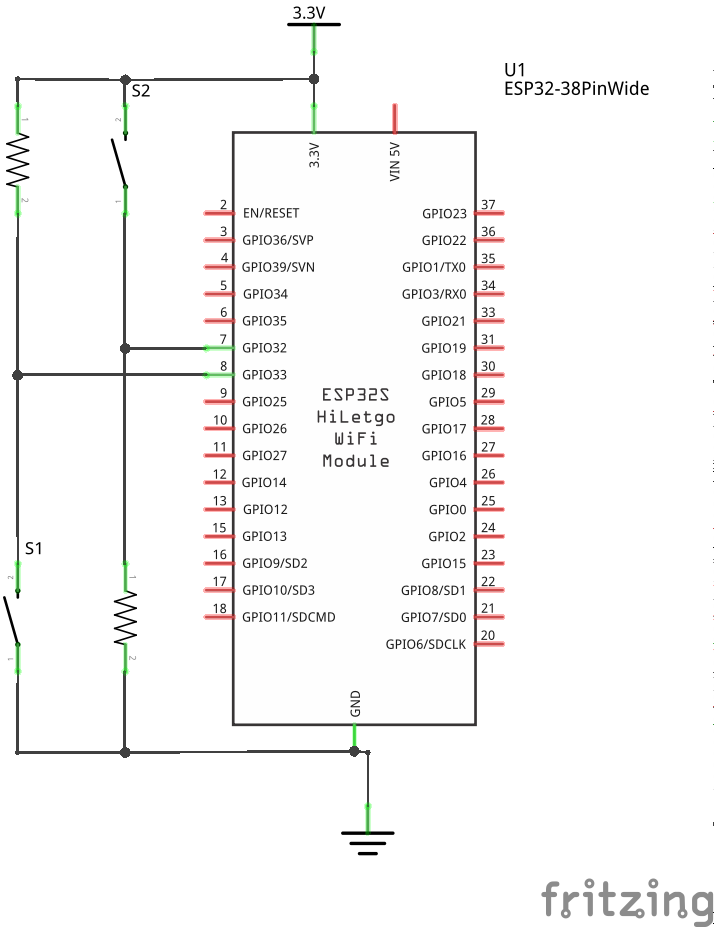

# Opgave 2. -  Debounce
* Kilde: 
  * https://www.arduino.cc/en/tutorial/debounce
  * https://github.com/evert-arias/EasyButton/tree/master/examples/PressedForDuration
  * https://www.esp32.com/viewtopic.php?t=6289
  * https://www.espressif.com/sites/default/files/documentation/esp32_datasheet_en.pdf
  
## Start et nyt Project i PlatformIO - New Project :
### Indtast Parameter for nyt project:
  1. Name: **ESP32_Debounce**  
  2. Board: **Espressif ESP32 Dev Module**  
  3. Framework: **Arduino**  
  4. Location: **Use default location**  
  5. Tryk på [Finish] når alle felter er udfyldt.  

## Diagram:
  

### INPUT_PULLUP/DOWN:
* https://www.espressif.com/sites/default/files/documentation/esp32_datasheet_en.pdf
* GPIO pins 34-39 are input-only. These pins do not feature an output driver or internal pullup/pull-down circuitry. 
* The pin names are: 
  * VDET_1 (GPIO34) 
  * VDET_2 (GPIO35)
  * SENSOR_VP (GPIO36) 
    * SENSOR_CAPP (GPIO37)
    * SENSOR_CAPN (GPIO38) 
  * SENSOR_VN (GPIO39) 
## Kode:
``` 
/*
  Debounce

  Each time the input pin goes from LOW to HIGH (e.g. because of a push-button
  press), the output pin is toggled from LOW to HIGH or HIGH to LOW. There's a
  minimum delay between toggles to debounce the circuit (i.e. to ignore noise).

  The circuit:
  - LED attached from pin 13 to ground
  - pushbutton attached from pin 2 to +5V
  - 10 kilohm resistor attached from pin 2 to ground

  - Note: On most Arduino boards, there is already an LED on the board connected
    to pin 13, so you don't need any extra components for this example.

  created 21 Nov 2006
  by David A. Mellis
  modified 30 Aug 2011
  by Limor Fried
  modified 28 Dec 2012
  by Mike Walters
  modified 30 Aug 2016
  by Arturo Guadalupi

  This example code is in the public domain.

  http://www.arduino.cc/en/Tutorial/Debounce
*/

#include <Arduino.h>

// constants won't change. They're used here to set pin numbers:
const int buttonPin = 2;    // the number of the pushbutton pin
const int ledPin = 13;      // the number of the LED pin

// Variables will change:
int ledState = HIGH;         // the current state of the output pin
int buttonState;             // the current reading from the input pin
int lastButtonState = LOW;   // the previous reading from the input pin

// the following variables are unsigned longs because the time, measured in
// milliseconds, will quickly become a bigger number than can be stored in an int.
unsigned long lastDebounceTime = 0;  // the last time the output pin was toggled
unsigned long debounceDelay = 50;    // the debounce time; increase if the output flickers

void setup() {
  Serial.begin(115200);

  pinMode(buttonPin, INPUT);
  pinMode(ledPin, OUTPUT);
/*
  pinMode(33, INPUT_PULLUP);
  pinMode(34, INPUT_PULLDOWN);
*/
  // set initial LED state
  digitalWrite(ledPin, ledState);
}

void loop() {
  // read the state of the switch into a local variable:
  int reading = digitalRead(buttonPin);

  // check to see if you just pressed the button
  // (i.e. the input went from LOW to HIGH), and you've waited long enough
  // since the last press to ignore any noise:

  // If the switch changed, due to noise or pressing:
  if (reading != lastButtonState) {
    // reset the debouncing timer
    lastDebounceTime = millis();
  }

  if ((millis() - lastDebounceTime) > debounceDelay) {
    // whatever the reading is at, it's been there for longer than the debounce
    // delay, so take it as the actual current state:

    // if the button state has changed:
    if (reading != buttonState) {
      buttonState = reading;

      // only toggle the LED if the new button state is HIGH
      if (buttonState == HIGH) {
        ledState = !ledState;
      }
    }
  }

  // set the LED:
  digitalWrite(ledPin, ledState);

  // save the reading. Next time through the loop, it'll be the lastButtonState:
  lastButtonState = reading;
}
``` 

